# Committees UX v2 — Design Package & Build Plan

> **Status:** Design complete, pending team review · Build phases proposed below
> **Package:** [`UX-SPEC.md`](./UX-SPEC.md) (IA, personas, signature moves, chrome/entity mapping) · [`index.html`](./index.html) (clickable gallery — opens from disk, light + dark) · 7 signature screens (`01`–`07-*.html`) · [`screenshots/`](./screenshots/)
> **Strategic context:** Committees is the **anchor listing for MJ Central** — externally validated whitespace (board portals are per-seat priced and quote-gated at $4K–$150K+/yr, structurally wrong for 20–200-committee associations; AMS committee modules are shallow roster-trackers; no AI-native multi-committee product exists). Entities and schema are built; this package closes the UI gap. See `new-products/market-analysis-2026.md` for the full market case.

---

## 1. Why v2 (what changed from the v1 mockups)

The v1 package (`plans/mockups/`) was a design-options **catalog**: three visual treatments per journey, hardcoded palette (matching neither MJ tokens nor its own documented colors), light-only, generic data, happy-path only. v2 is one opinionated **product**:

- **Verbatim `--mj-*` semantic tokens** with a true dark theme (zero hardcoded colors outside token definition blocks) — buildable in MJ Explorer without translation
- **Real sample data** from `Demos/*.sql` — actual committees, people, motions, and votes (including a recorded dissent and genuinely pending minutes), at realistic density (42 committees, not 3)
- **Designed states**: loading skeletons, empty states, permission-locked committee rows, read-only views
- **Honest schema boundaries**: everything maps to real entities; the one v-next entity (sealed e-ballots) is flagged as such, not faked
- **MJ Explorer chrome discipline**: header/body trio and slot rules throughout, with Live Meeting Mode as a *documented* full-screen exception
- Every page screenshot-QA'd in both themes; interactions smoke-tested headlessly

## 2. The five signature moves (see UX-SPEC.md for full detail)

1. **Governance Health Grid** — the home screen is a triage board, not a list. Every signal is *computed from real columns*: quorum risk (Attendance × voting Memberships), term hygiene (Term.EndDate — a no-active-term lapse in the sample data becomes the product's loudest red flag), minutes debt (Minute.ApprovalStatus age), action aging (ActionItem.DueDate). Healthy committees go quiet.
2. **One meeting spine** — agenda items are the same records in three tenses: prep → running order → minutes skeleton. Nothing transcribed twice.
3. **Assist-mode AI, one visual grammar** — violet + dashed + sparkle = "not yet the record," Accept · Edit · Dismiss, and provenance that survives acceptance ("Drafted by AI · Confirmed by L. Nakamura, 2:12 PM"). AI appears on five of seven screens and takes over none.
4. **The term clock** — time as an axis: roster gantt with today-line, 90-day lens, renewal-intent capture feeding the succession pipeline.
5. **Two-speed UX** — dense grids for staff; a one-click "next thing" feed for the quarterly volunteer, down to a 390px phone frame.

## 3. The screens

### 00 · Gallery
[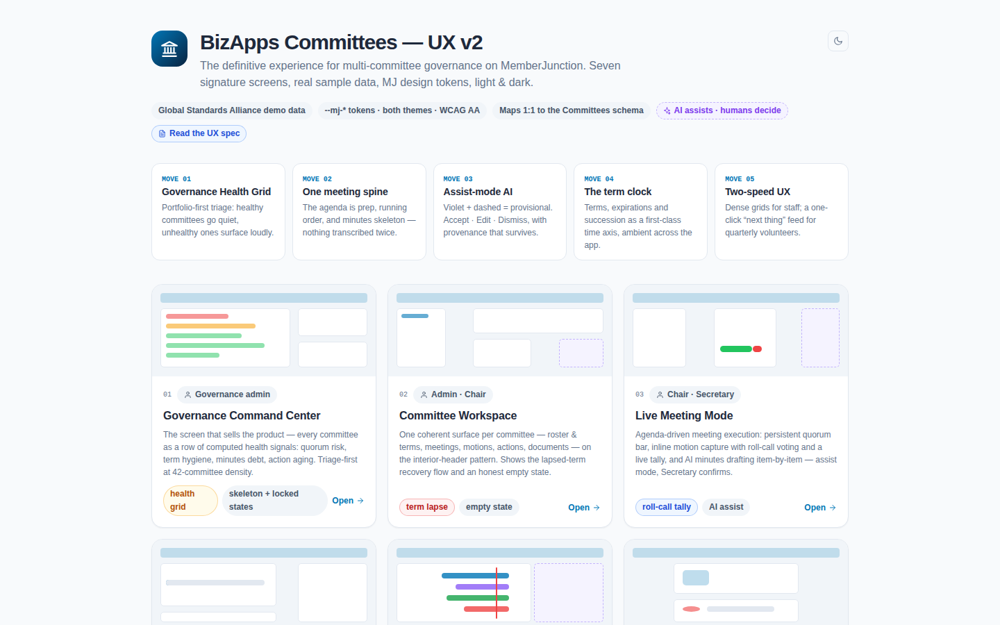](./index.html)

### 01 · Governance Command Center — *the screen that sells the product*
Cross-committee triage: health grid with quorum-risk/term/minutes/actions signals, this-week panel with quorum forecasting, needs-attention feed, permission-locked rows as designed states.
[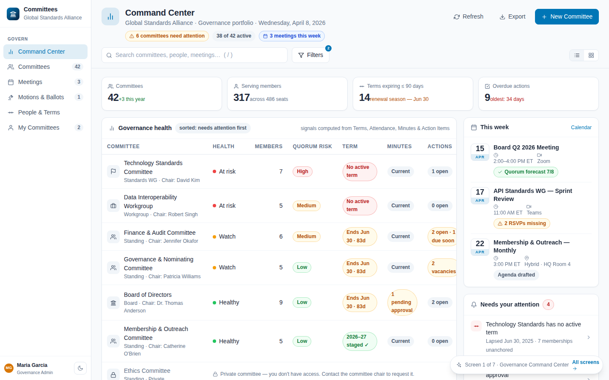](./01-command-center.html)
Dark theme:
[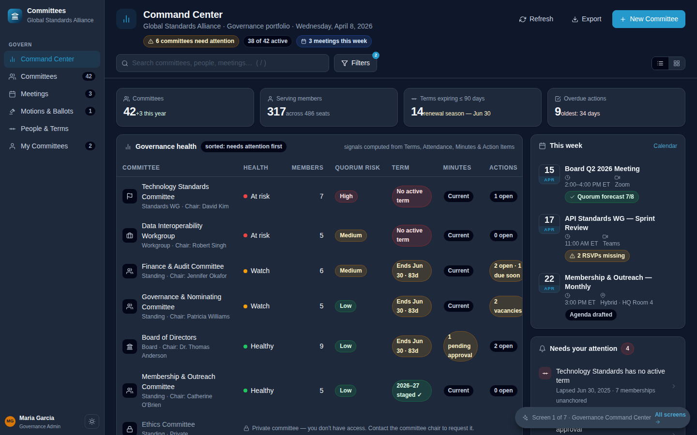](./01-command-center.html)

### 02 · Committee Workspace
One coherent surface per committee: roster + terms, meetings, motions, actions, documents.
[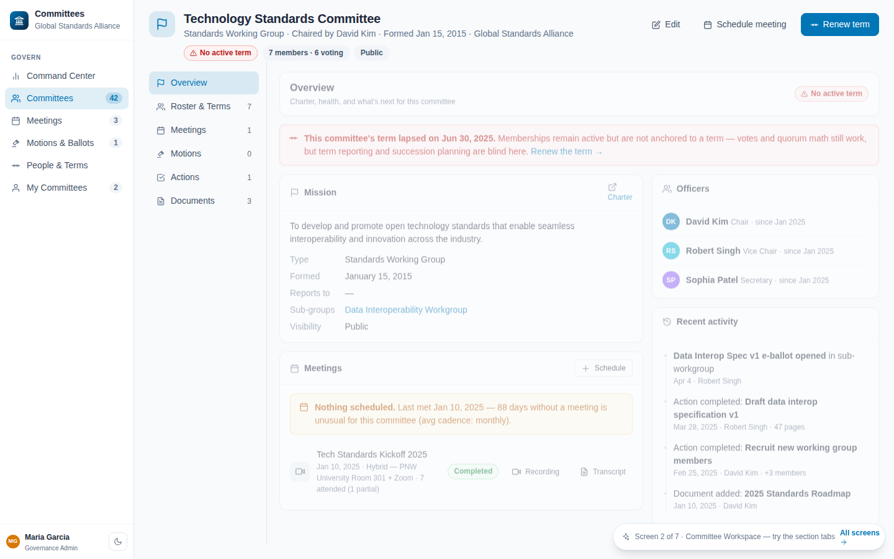](./02-committee-workspace.html)

### 03 · Live Meeting Mode — *strongest screen; earns the paid tier*
Agenda-driven execution: persistent quorum bar, motion capture with seconds + roll-call voting (threshold math knows a motion has passed before the last vote), AI minutes rail growing item-by-item with the Secretary as the only pen. Documented full-screen chrome exception.
[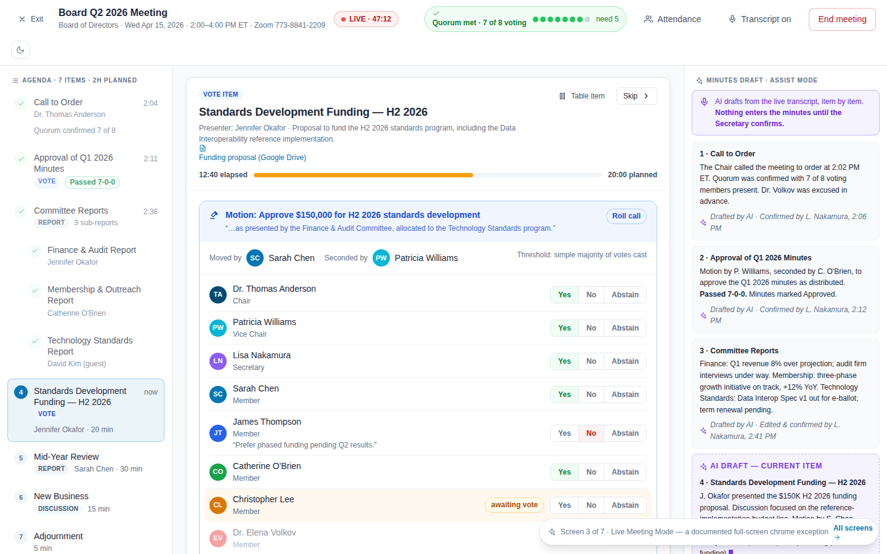](./03-live-meeting.html)
Dark theme:
[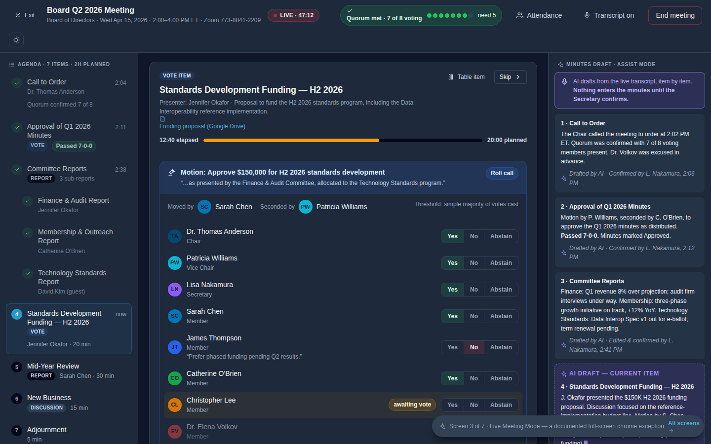](./03-live-meeting.html)

### 04 · Motions & Voting
Between-meeting e-ballots with quorum/threshold logic and a defensible audit trail. (Sealed-ballot entity flagged v-next.)
[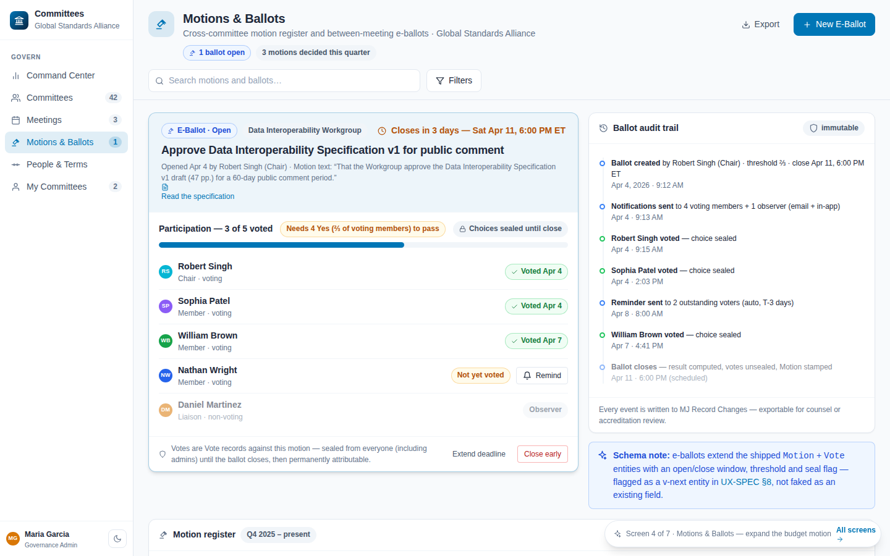](./04-motions-voting.html)

### 05 · Terms & Succession
The term clock: roster gantt, expiring edges, vacancy pipeline, renewal-intent capture, AI succession suggestions (assist-mode).
[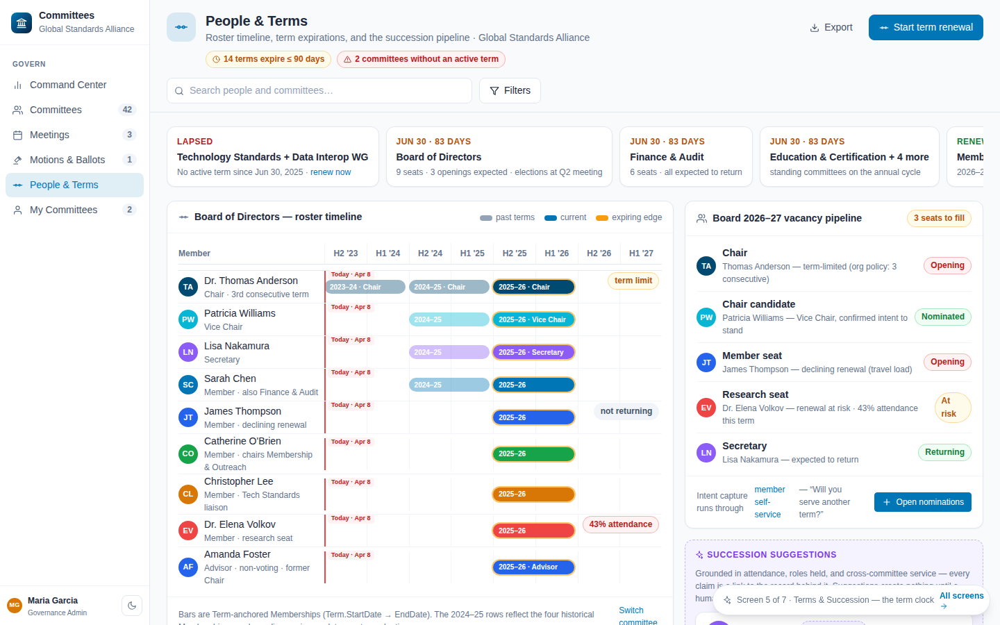](./05-terms-succession.html)
Dark theme:
[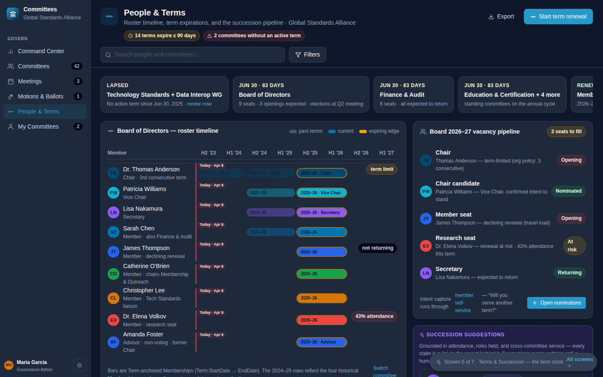](./05-terms-succession.html)

### 06 · Member Home — *the quarterly-volunteer view*
My committees, my actions, next meeting, one-click everything.
[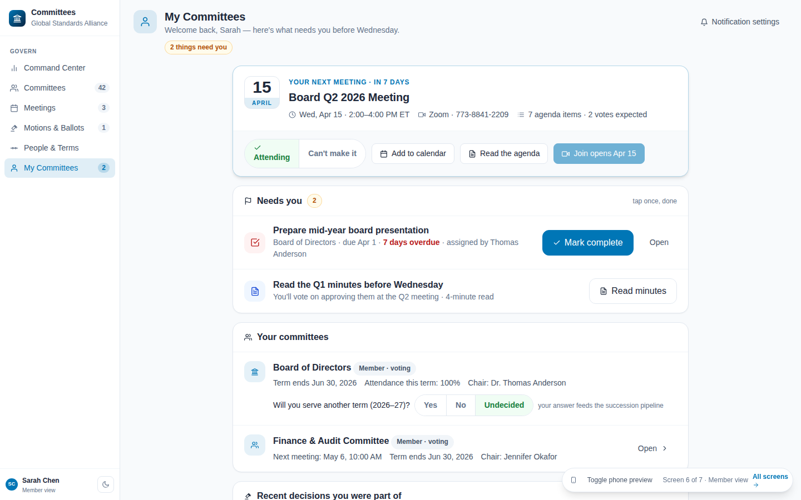](./06-member-home.html)
Mobile (390px):
[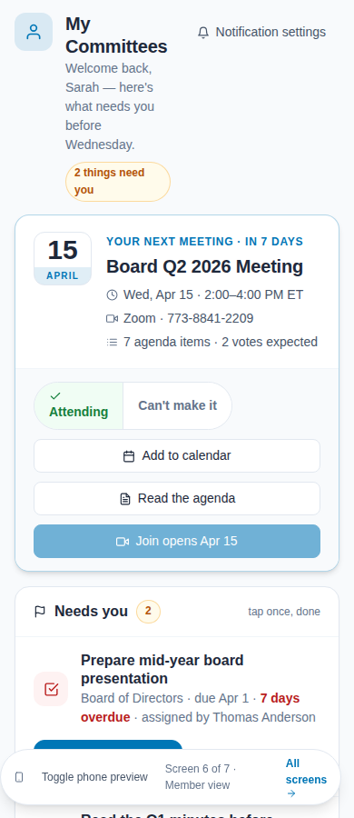](./06-member-home.html)

### 07 · Minutes Review & Approval
AI-drafted minutes through human review to the approved record, with provenance intact.
[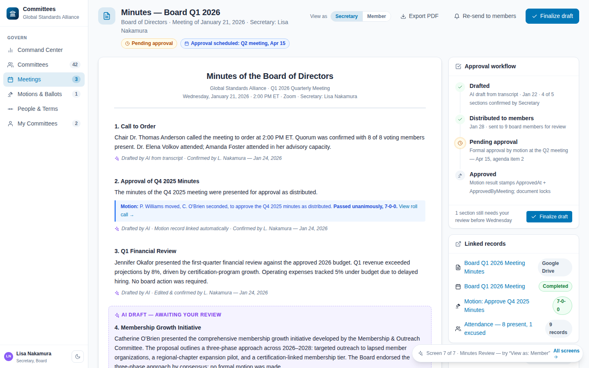](./07-minutes-review.html)

## 4. Proposed build phases (Angular, on the existing entity layer)

| Phase | Scope | Screens | Notes |
|---|---|---|---|
| **1 — Land** | Committees UI package scaffold (`packages/Angular` per MJ conventions), chrome wiring, Governance Command Center + Committee Workspace | 01, 02 | The health-grid signals are computed queries over existing entities — engine-side helpers, no schema change. This phase alone makes Committees demoable as the MJC anchor |
| **2 — Govern** | Live Meeting Mode + Motions & Voting + Minutes Review | 03, 04, 07 | Motion/Vote/Minute entities exist; AI minutes drafting rides MJ agents in assist-mode (grammar per UX-SPEC §AI). Sealed e-ballot entity = one small migration (flagged v-next in spec) |
| **3 — Sustain** | Terms & Succession + Member Home (+ mobile) | 05, 06 | Term gantt + renewal-intent capture; member view reuses workspace components at volunteer speed |
| **4 — Polish** | Designer's next-queue: agenda builder (prep tense), term-renewal wizard, ballot-close ceremony, notification/digest design | — | Design first, then build; the volunteer "we'll email you" promise needs the digest designed |

**Engineering ground rules carried from the spec:** semantic `--mj-*` tokens only (CI gate exists in MJ); `<mj-page-layout>` trio + slot rules with Live Meeting as the one documented exception; every AI surface uses the provisional grammar with provenance persisted; all signals computed from real columns — no shadow fields.

## 5. Open items for review

1. Team pass on the gallery (`index.html` from disk, toggle both themes) — pick fights with any signature move *now*, before Phase 1 starts
2. Sealed e-ballot entity: approve the v-next migration or descope screen 04's between-meeting flow to motions-without-secrecy in v1
3. Phase 1 owner + start (pairs naturally with the August build slot alongside Awards)
4. Whether v1 `plans/mockups/` is archived or kept as reference (recommend: keep, marked superseded)
